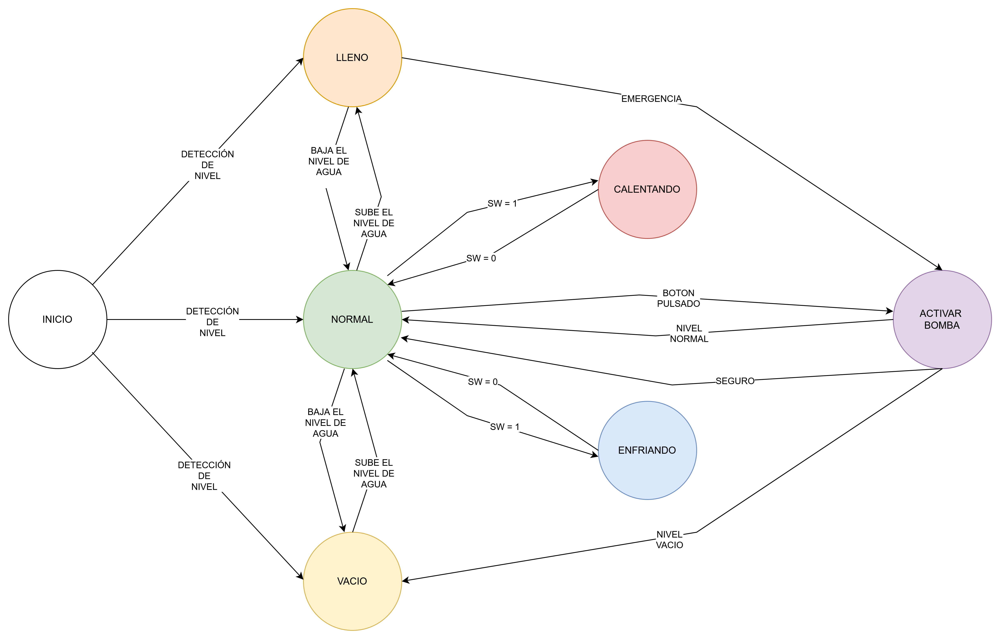

# 💧 Bidón de Agua Inteligente — FPGA

Un sistema embebido implementado en FPGA que controla automáticamente el nivel de agua de un bidón, permite al usuario calentar o enfriar el agua mediante una célula Peltier, y protege los componentes impidiendo su uso cuando el bidón está vacío.

---

## ¿Qué hace este proyecto?

Imagina un bidón de agua conectado a sensores y actuadores. Este sistema:

- **Mide el nivel de agua** continuamente usando un sensor de ultrasonidos.
- **Activa la bomba automáticamente** si el bidón está lleno, para evitar desbordamientos.
- **Permite al usuario calentar o enfriar el agua** mediante switches cuando el nivel es normal.
- **Bloquea todos los actuadores** si el bidón está vacío, protegiendo tanto la bomba como la Peltier.

Todo el control se ejecuta en una FPGA (diseñada en Vivado), sin necesidad de microcontrolador ni ordenador.


---


## 🎥 Video de presentación

[](https://youtu.be/03xzefw8Nbg)


---

## Hardware utilizado

| Componente | Función |
|---|---|
| FPGA | Unidad de control principal |
| Sensor HC-SR04 | Mide el nivel de agua por ultrasonidos |
| Bomba de agua | Vacía el bidón (automática o manual) |
| Célula Peltier | Calienta o enfría el agua |
| Switches | El usuario selecciona modo calor/frío |
| Botón | El usuario activa manualmente la bomba |

---

## Lógica de funcionamiento

El sistema se basa en una **máquina de estados finitos (FSM)** con 6 estados:

### Estados principales del bidón

**LLENO** — el sensor detecta nivel máximo.
El sistema activa la bomba automáticamente para bajar el nivel. El usuario no necesita hacer nada.

**NORMAL** — el nivel está entre mínimo y máximo.
El usuario tiene control total: puede encender la Peltier (calentando o enfriando) con los switches, o activar la bomba manualmente pulsando el botón.

**VACÍO** — el sensor detecta nivel mínimo.
El sistema bloquea cualquier orden del usuario. Ni la bomba ni la Peltier se activan, para evitar daños por funcionamiento en seco.

### Estados de actuación

| Estado | Condición de entrada | Condición de salida |
|---|---|---|
| CALENTANDO | SW=1 desde NORMAL | SW=0 → vuelve a NORMAL / nivel vacío → VACÍO |
| ENFRIANDO | SW=1 desde NORMAL | SW=0 → vuelve a NORMAL / nivel vacío → VACÍO |
| ACTIVAR BOMBA | Botón pulsado desde NORMAL, o nivel lleno | Nivel normal → vuelve a NORMAL |

### Diagrama de estados



---

## Estructura del repositorio

```
📁 Deposito-de-Agua-Inteligente-DAI-/
├── 📁 DAI.srcs/                  
      └── 📁 constraints/                            # Archivos .xdc (pines de la FPGA)
      └── 📁 sim/                                    # Testbenches y simulaciones
      └── 📁 sources/                                # Código fuente VHDL
      └── 📁 utils/         
├── 📁 docs/                                          # Documentación e imágenes
      └── diagrama_estados.png                        # Diagrama de estados del sistema
      └── Deposito de Agua Inteligente.png            # Pancarta de presentación
      └── PHR26-CIM31-13_FINAL.pdf                    # Memoria del proyecto
└── DAI.xpr                                           # Programa
└── README.md
```

---

## Cómo replicarlo

### Requisitos

- Vivado 2022.x o superior
- FPGA compatible (el proyecto está diseñado para **Basys 3**)
- Sensor HC-SR04
- Bomba de agua 5V
- Módulo Peltier TEC1-12706 (o similar)

### Pasos

1. Clona el repositorio:
   ```bash
   git clone https://github.com/danielmcneilis/Deposito-de-Agua-Inteligente-DAI-.git
   ```
2. Abre Vivado y carga el proyecto desde la carpeta `src/`.
3. Revisa el archivo de constraints para asignar los pines según tu placa.
4. Sintetiza, implementa y genera el bitstream.
5. Programa la FPGA.

---

## Autores:
- Víctor Romera Oliva
- Daniel McNeilis Franqueza
- Enrique Revieltas Magdalena
- Sergio Valdivieso Yagüe

Desarrollado como proyecto académico.  
Si tienes dudas o sugerencias, abre un [issue](../../issues).
